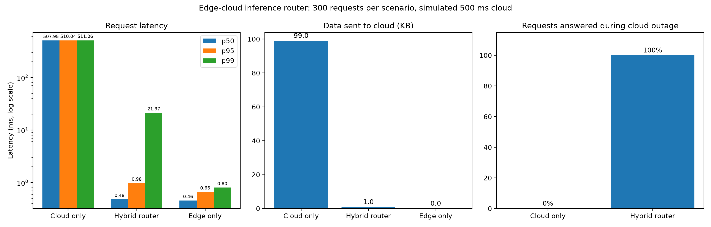
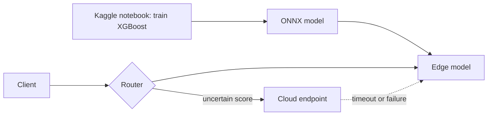

# Edge-Cloud Inference Router

A latency-first hybrid inference router. A small ONNX fraud model runs at the edge and answers confident requests in under a millisecond. Only uncertain requests are sent to a (simulated) cloud endpoint, and the system keeps answering when the cloud is down.



## Results

300 requests per scenario, same transactions in every scenario, cloud simulated with a 500 ms delay.

| Scenario | p50 (ms) | p95 (ms) | p99 (ms) | Handled at edge | Data sent to cloud | Answered during outage |
|---|---|---|---|---|---|---|
| Cloud only | 507.95 | 510.04 | 511.06 | 0% | 99.0 KB | 0% |
| Hybrid router | 0.48 | 0.98 | 21.37 | 99% | 1.0 KB | 100% |
| Edge only | 0.46 | 0.66 | 0.80 | 100% | 0 KB | 100% |

The hybrid p99 (21.37 ms) is higher than its p95 because about 1% of requests score in the uncertain band and are sent to the cloud, so those few requests set the 99th percentile.

## How it works



1. The router scores every transaction on the edge model first.
2. If the fraud probability is at most 0.1 or at least 0.9, the edge answer is returned immediately.
3. Scores in between go to the cloud. If the cloud times out or fails, the router falls back to the edge answer and marks the response `fell_back: true`.

The thresholds are configurable (`ROUTE_LOW`, `ROUTE_HIGH`), as are `CLOUD_TIMEOUT_S` and `CLOUD_DELAY_MS`.

## Method and limitations

- **Hardware:** Apple Silicon MacBook Air, everything on one machine over localhost. Latency is measured by the client and includes the HTTP round trip to the router. Apple M5 chip.
- **Simulated cloud:** the cloud endpoint runs the same model plus a fixed 500 ms delay. The speedup therefore reflects that setting, not a real network. Accuracy is identical by construction, so this benchmark does not measure the accuracy benefit of a larger cloud model.
- **Outage test:** the outage flag fails instantly. A real network blackhole would make uncertain requests wait for the timeout before falling back.
- **Data:** the benchmark sample has 1,998 rows from the held-out test split of the [ULB credit card fraud dataset](https://www.kaggle.com/datasets/mlg-ulb/creditcardfraud), including all 98 test fraud cases (about 5% fraud, versus 0.17% in the full data). The data file is not committed.
- **Model:** XGBoost (100 trees, depth 4), exported to ONNX. On the test split, fraud precision was 0.818 and recall 0.827.
- Numbers vary slightly between runs.

## Status

| Part | Status |
|---|---|
| Edge inference (ONNX, FastAPI) | Done |
| Router with timeout fallback | Done |
| Benchmark harness and charts | Done |
| Model versioning on Kaggle | Basic: model file is committed; Kaggle download planned |
| Drift detection and retraining loop | Planned |
| Multiple edge nodes and agent layer | Planned |
| DePIN adapter | Planned |

## Run it

Requires Python 3.12 and [uv](https://docs.astral.sh/uv/).

```bash
git clone https://github.com/mrunaliniamarnath25-sudo/edge-cloud-inference-router
cd edge-cloud-inference-router
uv sync
uv run pytest -q
```

To reproduce the benchmark, export `benchmark_sample.csv` with the cell in the training notebook ([Kaggle notebook](https://www.kaggle.com/code/mrunalini4196/edge-cloud-router-training)), save it as `data/benchmark_sample.csv`, then:

```bash
uv run python bench/run_benchmark.py --n 300
uv run python bench/make_chart.py
```

## License

MIT
